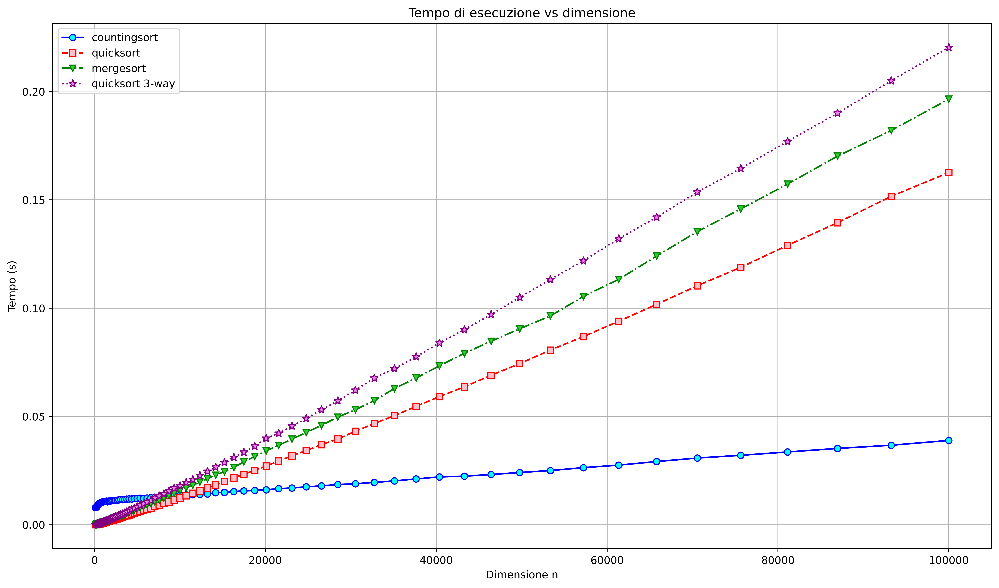
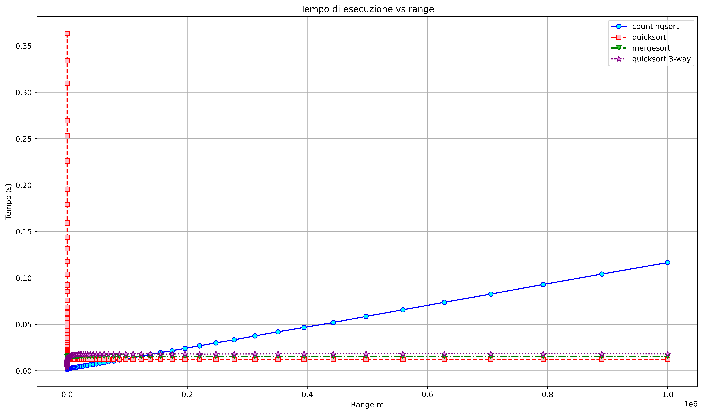

# Sorting Algorithms Benchmarking: An Empirical Analysis

## Project Overview
This repository contains a comprehensive empirical study of sorting algorithms, focusing on how performance varies based on array size ($n$) and the range of values ($m$).

The project was developed in **May 2025** for the **Algorithms and Data Structures** course, part of the **Bachelor's Degree in Computer Science (Triennale di Informatica)** at the **Università degli Studi di Udine**.

## Key Features
* **Algorithms Analyzed**: Implementation of **Quicksort**, **Countingsort**, and **Quicksort 3-way**, with **Mergesort** as the group's custom addition.
* **Scientific Methodology**: Performance measurement using Python’s `perf_counter()` to ensure high precision.
* **Data Sampling**: 100 samples generated using a **geometric series** to ensure high data density in critical performance ranges.
* **Reliability**: 1,000 independent trials per sample to calculate an accurate average execution time, subtracting the overhead of array initialization.
* **Technical Reporting**: A detailed 9-page technical report authored in **LaTeX**.

## Technical Stack
* **Language**: Python (NumPy and Matplotlib for visualization).
* **Environment**: Developed using **Google Colab** and **Visual Studio Code**.
* **Hardware**: Benchmarks performed on an **Acer Predator Helios NEO 16** (Intel i9 14900HX, 16GB RAM).

## Key Results

### 1. Performance vs. Array Size (n)
Our analysis shows that while $O(n \log n)$ algorithms perform similarly for small arrays, **Countingsort** becomes the most efficient choice once $n > 10^4$. This occurs because, with a fixed range, the number of duplicate values increases with the size of the array, a scenario where Countingsort excels.


*Fig. 1: Execution time in function of array size n.*

### 2. Performance vs. Value Range (m)
**Countingsort** is optimal for small ranges but becomes the slowest algorithm when the range $m$ exceeds $10^5$ due to increased memory allocation costs. In contrast, **Mergesort** maintains constant performance regardless of the range since its logic is independent of the values within the array.


*Fig. 3: Execution time in function of integer range m.*

### 3. Worst-Case Scenarios
Under stress conditions (e.g., arrays sorted in descending order), **Quicksort** and **Quicksort 3-way** degrade to $O(n^2)$ complexity. **Mergesort** remains stable at $O(n \log n)$ because its division logic always splits the array consistently, regardless of data distribution.

## Repository Structure
```text
├── src/                # Modular implementation of sorting algorithms
├── notebooks/          # Original Google Colab experiments (.ipynb)
├── results/            # Exported performance plots (Linear & Log-Log)
├── reports/            # Technical reports
│   ├── en/             # English version (Translated)
│   └── it/             # Italian version (Original 2025)
└── README.md           # Project documentation
```

## Acknowledgments
* This project was developed as part of the Algorithms and Data Structures course at the University of Udine.
* This repository was organized and translated with the assistance of Google Gemini in order to improve international accessibility.*

## Contributors

* Federico Del Pup
* Luigi Pascu
* Matteo Passador
* Stefano Toneguzzo

